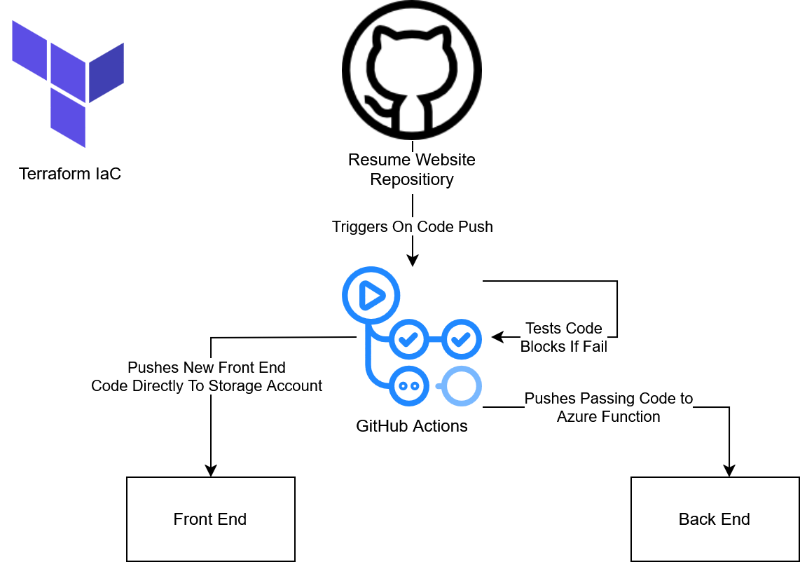
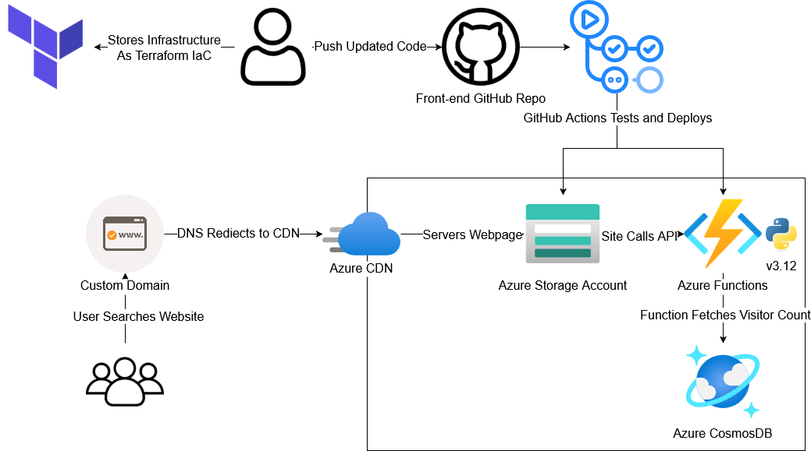

After passing my AZ-104, I needed a new challenge, something practical to apply what I'd learned. That’s when I discovered the Cloud Resume Challenge by Forrest Brazeal: a full-stack cloud project that tests your skills by building a public resume site powered by serverless Azure infrastructure.

While I’ve built and deployed applications to a local environment as part of my role as Systems Administrator, I hadn’t exactly dipped my toes into the world of cloud development. This looked to be a fantastic way to change that!

My site is available at https://resume.gleesonlabs.com/

And the source code is available here https://github.com/Electr0105/resume-website

---

## Step 1: The Front End

First step was to build a resume to host, my usual PDF wasn't going to do. While my HTML and CSS skills were a little rusty from university, it was an enjoyable process converting my typical resume to a static site. I utilised a grid display to allow my content to stack neatly and predictably, along with some darker colours, and shading to distinguish the sections. Keeping it simple was my best advice for this, sticking to a small handful of colours streamlined this process greatly.

Next was the site hosting. While I typically would’ve gravitated to a more tailored Azure service, like Azure Static Web Apps, they provide too much abstraction for this project, so a standard Azure Storage Account was used instead. The initial deployment of the site was straight-forward, just uploading the required site files to the $web container within my storage account, however, organising HTTPS was a little more involved. Instead of creating a typical Static Web App and having Azure handle the TLS certificates automatically, like I’d done before, the web traffic had to be routed through Azure CDN. Content Delivery Networks help to tackle the challenges of site scalability, content delivery and security. Within CDN, you create an endpoint linking your storage account, custom domain and CDN altogether, making the management pretty easy. I’ll admit, I was worried that the reduced abstraction would cause some headaches, but it goes to show how accessible Azure can be, even at those lower levels. Finally, configuring HTTPS was as simple as flicking a switch and waiting for your certificate to provision and propagate.

---

## Step 2: Building the API

For a complete back end, I needed CosmosDB and a Python powered Azure Function. I went into this section pretty confidence, I have written plenty of Python and code that’s interacted with live databases before, how hard could this be?

If you start this section without knowing how Python decorators and serverless functions work, you’re in for a rough time. I can say that from personal experience. I'm much more comfortable having a server I can SSH into to manage my environment, so having that crutch taken away and instead using a Platform as a Service (PaaS), was an extremely unique experience. After organising the Identity and Access Management of my CosmosDB and Azure Functions, allowing the services to communicate securely, where I’d strongly recommend RBAC identities over direct key access. That was step 2 ticked off.

---

## Step 3: Front End / Back End Integration
For a successful integration, the resume website needed to fetch and display the current visitor count via. the back end using JavaScript. You should also write a few tests for your Python code to ensure everything is behaving as expected. What are the expected returns? How should the function handle incorrectly formatted requests? What about edge cases? I found this section the easiest, as I’ve written similar code before. However, there was one pain point… CORS. While an important component of web security, it can still require a little bit of wrangling. With some persistence, though, I had my static webpage making and handling requests with my Python API.

---

## Step 4: Autopmation / CI
Setting up CI/CD for the front and back ends and converting the back end into Terraform was a fantastic challenge. It’s exactly the kind of work I expect a cloud engineer to be completing day-to-day. Manually updating, changing and testing your Azure resources would be extremely time-consuming, so why not have GitHub Actions do the work for you? There’s something so satisfying watching all of your checks and pipelines return green, refreshing your page and seeing your website update, makes all the work worth it.

This project was also my first exposure to Terraform. While I've managed infrastructure through Bicep and ARM Templates before, those languages are both Azure specific, limiting their scope. Getting to learn such a universal tool, such as Terraform, where you can write the same language and utilise the same tooling and maturity, was a great experience. Now, I can tear down and rebuild my infrastructure without touching the Azure portal, streamlining the deployment process.

---

## Finishing Up

I’d recommend this project to anyone looking for some tangible, hands-on experience with Azure. It touches on:

- Web development
- Serverless computing
- Python and JavaScript
- IAM and access management
- CI/CD automation and pipelines
- Infrastructure as Code (IaC)

 It can be a daunting jump to hosting something publicly and developing in a serverless environment, but it’s well worth the effort! If you're looking to get your hands dirty with real cloud infrastructure, take on this challenge. You'll come out of it with new skills, a deployable project, and a stronger understanding of what it means to build in the cloud!
